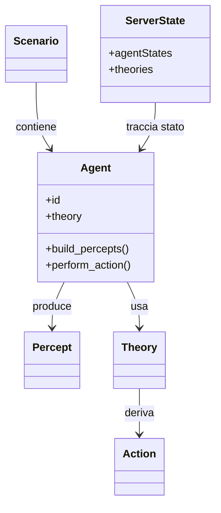

# Specifica dei Requisiti

Questa sezione descrive il **funzionamento finale** del sistema, indipendentemente dai dettagli implementativi.

## 1) Requisiti di Business

Il sistema deve permettere di:

1. sperimentare agenti virtuali in ambienti 3D con logiche dichiarative Prolog;
2. disaccoppiare simulazione (Godot) e decisione (Scala + Prolog);
3. cambiare logica degli agenti senza riavviare o ricompilare il server;
4. supportare più tipologie di scenari;
5. fornire una base tesistica e didattica su integrazione di AI simbolica e simulazione.

Valore atteso:

- rapidità di iterazione;
- confrontabilità tra logiche diverse;
- estensibilità verso nuovi agenti e scenari.

## 2) Modello di Dominio
### 2.1 Entità Principali

- **Agent**: entità attiva che percepisce e agisce;
- **Percept**: descrive un fatto osservabile dall'agente (ad esempio `enemy_close`);
- **Action**: decisione restituita dal motore Prolog (ad esempio, `attack`);
- **Theory**: insiemi di regole Prolog specifiche per agente/scenario;
- **Scenario**: contesto simulativo (soccer, tank);
- **World Object**: oggetti che non rappresentano agenti (palla, porte, semafori, ecc.);
- **Server State**: stato lato Scala (energia, ultime azioni, teoria per ogni agente, ecc.).

### 2.2 Diagramma Concettuale di Dominio

## 3) Requisiti Funzionali
### 3.1 Requisiti Funzionali Utente

- l'utente dovrebbe poter avviare gli scenari da un menù principale;
- l'utente deve poter configurare l'end-point della WebSocket, oltre al IP e alla porta;
- l'utente deve poter creare a run-time nuovi agenti nello scenario test di base;
- l'utente deve poter associare una logica Prolog per agente tramite l'inspector UI;
- l'utente deve poter osservare in tempo reale il comportamento emergente degli agenti;
- l'utente deve poter verificare output visivi di scenario (come il punteggio nello scenario soccer o il traffico in movimento).

### 3.2 Requisiti Funzionali di Sistema

- il client Godot deve inviare periodicamente al server l'ID agente, la lista dei percetti e, opzionalmente, una teoria (qualora si voglia aggiornare);
- il server deve rispondere ad ogni richiesta valida con l'azione da intraprendere e l'energia disponibile aggiornata;
- il server deve mantenere uno stato per ogni agente (energia, ultima azione, ultimi percetti, teoria, ecc.);
- in assenza di teoria per un agente, il server deve usare la teoria di fallback di default;
- le regole Prolog devono essere valutate con priorità deterministica (ordine delle regole e cut delle regole);
- gli agenti devono convertire l'azione simbolica in comportamento fisico locale;
- il sistema deve supportare più tipologie di agenti con lo stesso protocollo;
- il sistema deve esporre un endpoint di salute del servizio (`/health`);
- il sistema deve gestire errori di parsing o di decisione seguendo il protocollo standard.

## 4) Requisiti Non Funzionali

- **Modularità:** il backend deve essere strutturato in moduli con responsabilità separate;

- **Manutenibilità:** le logiche Prolog devono essere leggibili e commentate;

- **Scalabilità Locale:** il sistema deve poter gestire più agenti contemporaneamente in un solo scenario;

- **Estendibilità:** deve essere possibile aggiungere nuovi scenari ed agenti senza riscrivere il protocollo di base;

- **Osservabilità:** il comportamento deve essere verificabile tramite output in scena e log;

- **Robustezza:** il sistema deve degradare in modo controllato su input invalidi.

## 5) Requisiti di Implementazione

- Godot 4.6^ per la simulazione, definizione di scene e scripting;

- Scala 3^ come back-end;

- uso di una libreria Prolog per inferenza lato server (ad esempio tuProlog);

- comunicazione bidirezionale mediante WebSocket (stack fs2/http4s);

- serializzazione e deserializzazione JSON mediante libreria circe;

- progetto Scala importabile in ambiente IntelliJ come progetto sbt.