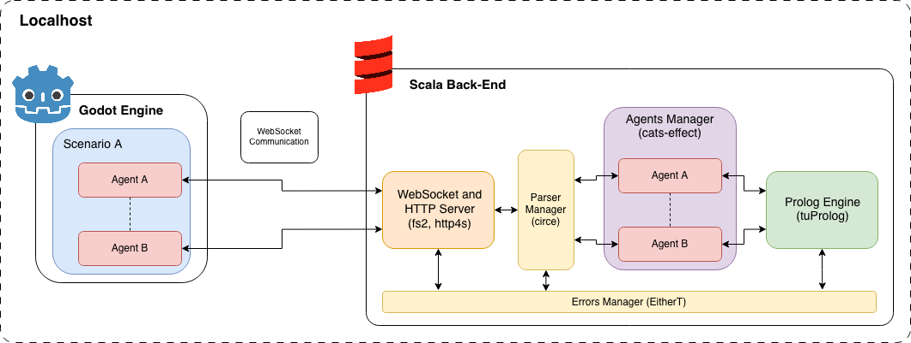
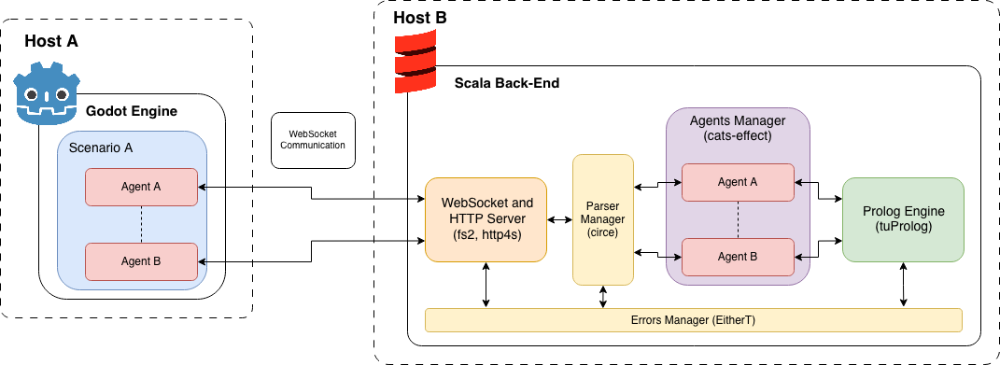
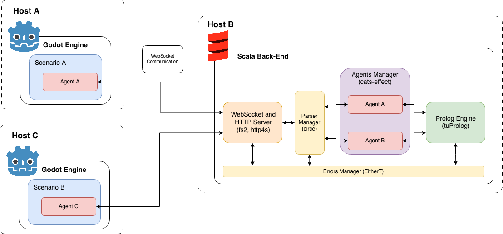
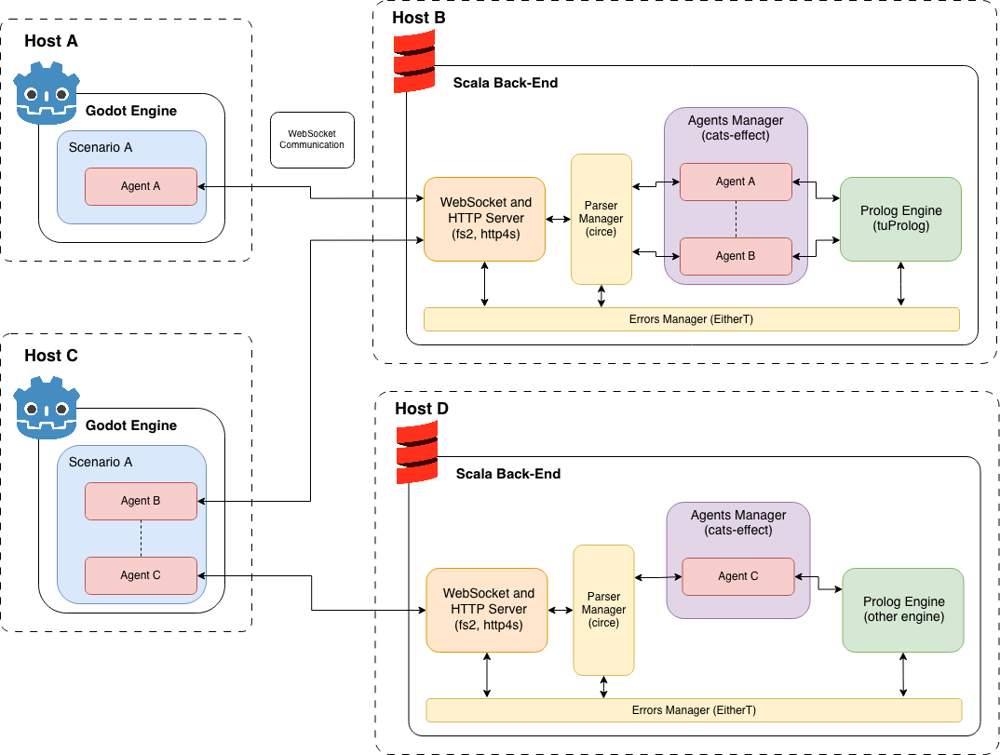
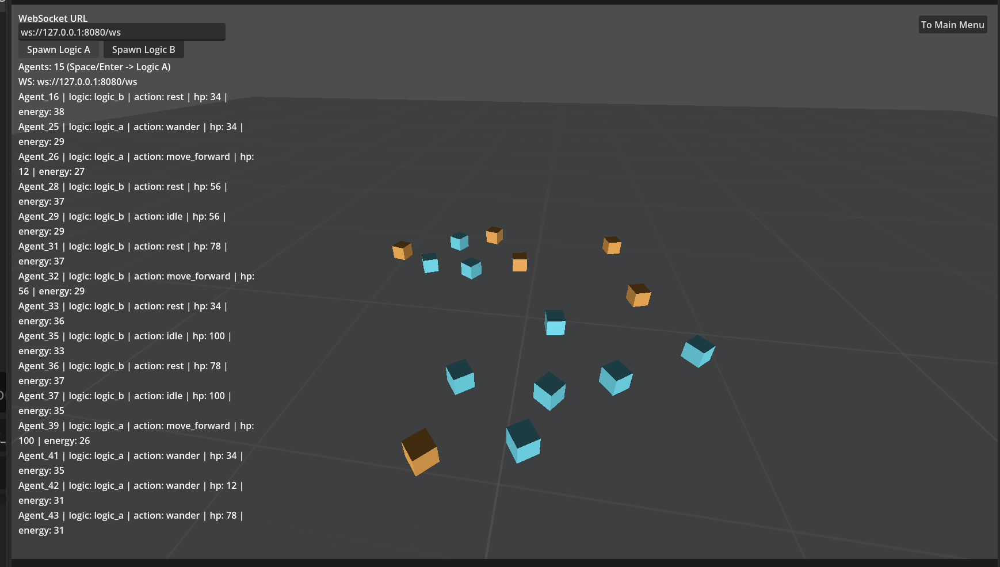
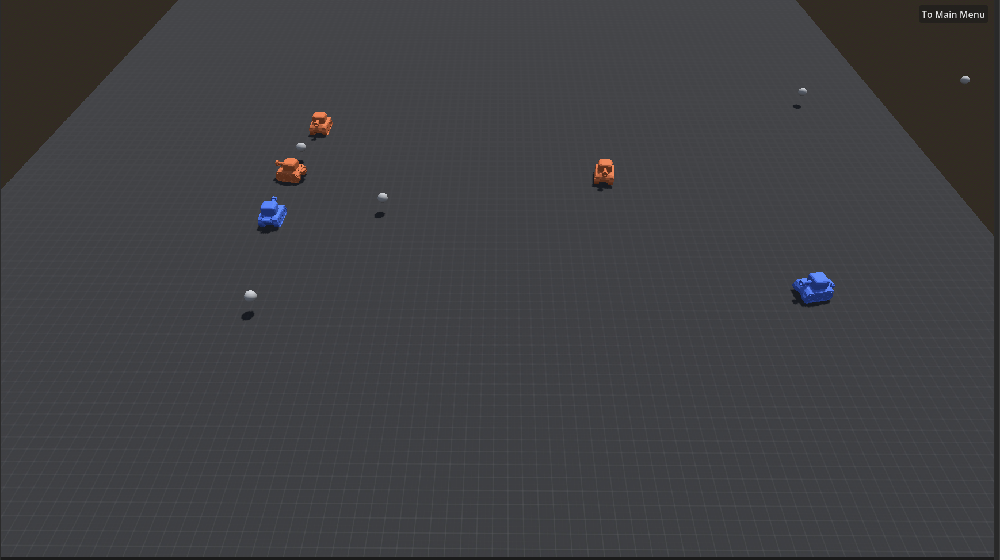
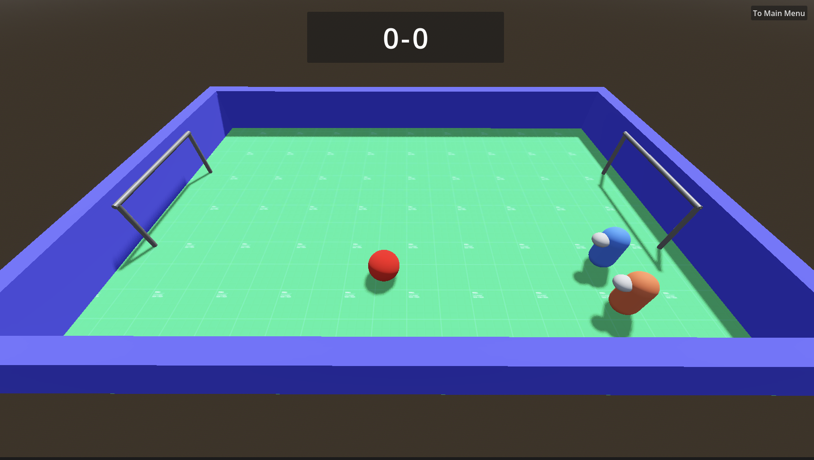
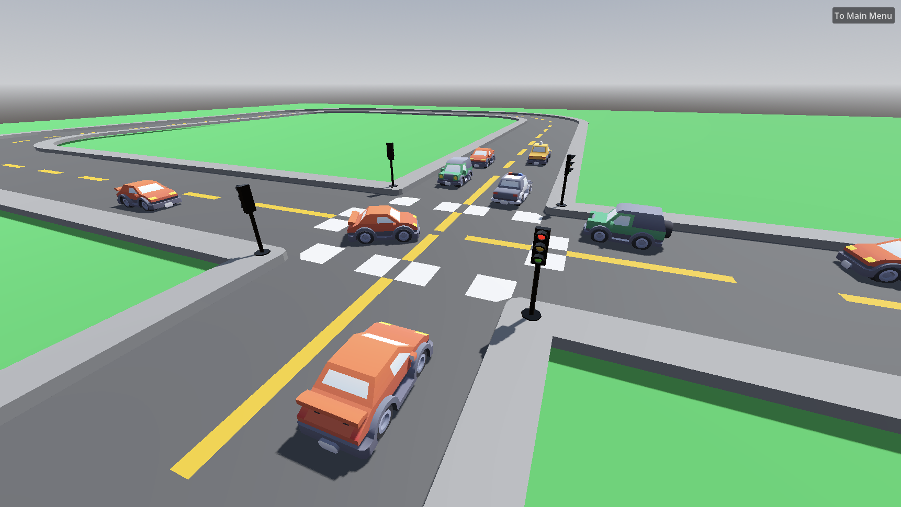

# Design Architetturale

## 1) Architettura complessiva

L'architettura segue un modello client-server distribuito a due livelli:

- **Livello di Simulazione (Godot):** rendering, fisica, sensori, UI, gestione scene.

- **Livello di Decisione (Scala + Prolog):** protocollo WebSocket, gestione dello stato degli agenti e inferenza su regole.

Lo scopo di questa architettura è quello di mantenere la simulazione indipendente dalla logica simbolica.

## 2) Architetture proposte

La soluzione ottenuta dà disposizione le seguenti modalità architetturali di funzionamento:

### 2.1 Architettura locale

La soluzione software ha la possibilità di essere eseguita in maniera locale. Un istanza Godot è in grado di potere eseguire uno scenario con diverse tipologie di agenti. Allo stesso modo, è possibile eseguire un istanza back-end nella quale verrà gestito il server WebSocket/HTTP, gli agenti e le loro teorie e stati che verranno utilizzati da un determinato Prolog Engine.

### 2.2 Architettura client-server

Poiché la comunicazione tra gli agenti Godot e il back-end avviene mediante protocollo WebSocket, sfruttando il protocollo HTTP (e anche la meccanica di upgrade di protocollo), è possibile configurare gli agenti, mediante indirizzi IP e porte, a collegarsi ad un istanza back-end che può eseguita su un altra macchina della rete.

### 2.3 Architettura multi-client distribuiti

Per quanto ovvio, le istanze Godot possono essere anche multiple, volendo simulare diversi scenari, anche su macchine differenti all'interno della rete.

### 2.4 Architettura completamente distribuita

Infine, è anche possibile distribuire il carico di lavoro del back-end su più istanze separate. In questo modo, non solo è possibile distribuire il carico, ma anche testare nuove componenti su back-end diversi, come ad esempio un altro Prolog Engine (es. SWIProlog).

Nota bene, è comunque necessario che le macchine siano raggiungibili in termini di rete e che gli agenti all'interno di Godot siano configurati opportunatamente con IP e porta del server al quale si intende a far collegare l'agente configurato. Inoltre, la natura del protocollo WebSocket e la possibilità di Godot di esportare per qualsiasi piattaforma, anche web, ne permette una completa compatibilità e distribuzione su qualsiasi sistema.

## 3) Pattern architetturali usati

1. **Client - Server**

    - Godot come client simulativo;
    - Scala come decision server.

2. **Composite**

    - ogni componente su Godot è indipendente dagli altri;
    - ogni componente ha le proprie responsabiltà (sensori, agenti, ecc.).

3. **Reader + EitherT pipeline (architettura funzionale)**

    - `AppReader` (`Kleisli`) per la gestione dipendenze;
    - `AppResult` (`EitherT`) per la gestione degli errori tipizzati.

4. **Policy-based behaviour**

    - logica agente esternalizzata in teoria Prolog e caricabile a runtime.

## 4) Componenti del sistema distribuito

1. **Godot Runtime**

    - produce i percetti;
    - applica le azioni da eseguire;
    - gestisce gli oggetti e la fisica di dominio.

2. **Scala Decision Server**

    - fornisce gli endpoint `/ws` `/health`;
    - gestisce l'orchestrazione delle decisioni;
    - gestisce lo stato per ogni agente e le loro teorie.

3. **Prolog Engine**

    - valuta le regole `decide_action/2`;
    - utilizza una teoria di fallback se la teoria fosse assente in un agente.

## 5) Motivazione delle scelte tecnologiche

### Godot 4.6

- strumento rapida per lo prototipazione 2D/3D;
- integrazione nativa con il protocollo WebSocket;
- buon supporto a scene e nodi composizionali;
- progetto open-source ampiamente supportato dalla community.

### Scala 3 + cats-effect + fs2 + http4s

- lo stack fornisce una gestione per la concorrenza controllata;
- fornisce un supporto agli stream e WebSocket robusto;
- composizione funzionale pulita.

### tuProlog

- permette l'integrazione embedded nel server;
- regole dichiarative facilmente sostituibili.

## 6) Diagramma di sequenza di protocollo

## 7) Scenari implementati

1. **Simple Agents**

    

    Pipeline minimale per la validazione di percetti/azioni ed il caricamento di logiche differenziate A/B

2. **Tank**

    

    Estensione del primo scenario per la validazione di un comportamento tattico semplificato, con la gestione di linee di fuoco, attacco e respawn.

3. **Soccer**

    

    Validazione dell'interazione multiagente su un obbiettivo condiviso (palla/goal) e dell'integrazione della simulazione fisica (rigid body).

4. **Vehicles**

    

    Validazione per l'integrazione di percetti più complessi (semafori, distanza, precedenza e deadlock).