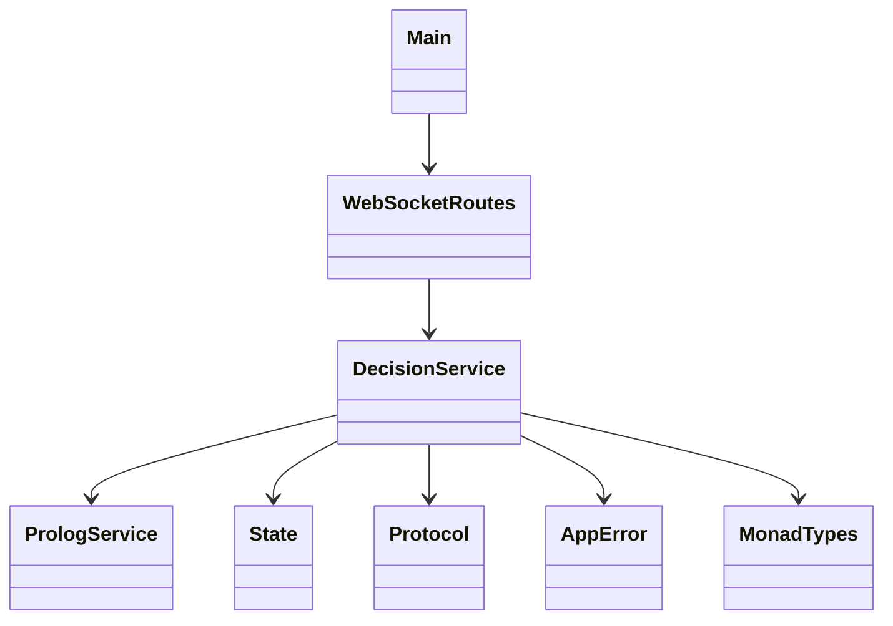
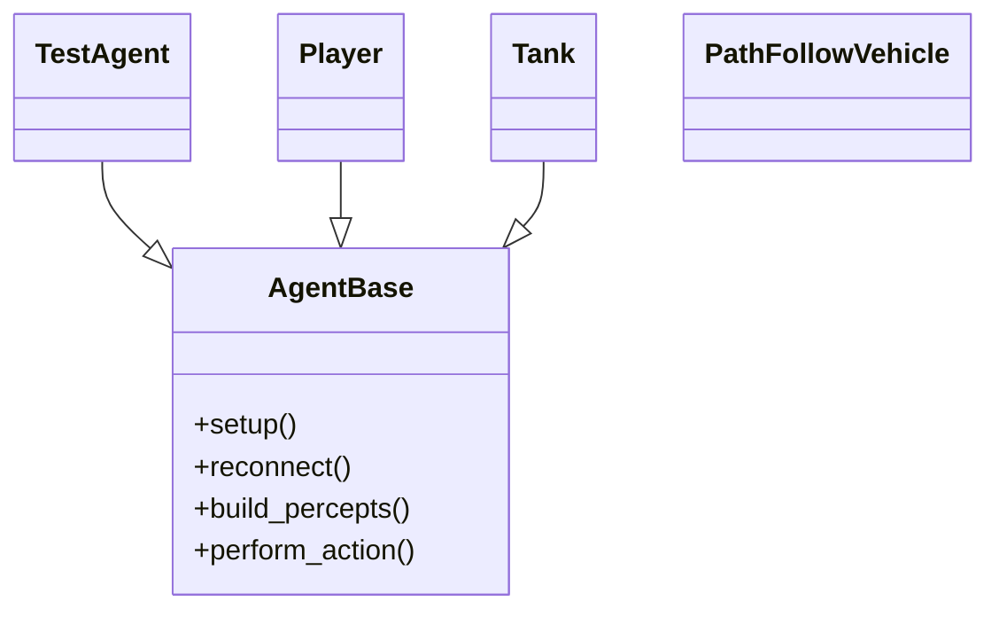

# Dettagli di Design

## 1) Organizzazione del codice

### 1.1 Backend Scala (`server/src/main/scala/app`)

- `Main.scala`: entry-point del server.

- `WebSocketRoutes.scala`: gestione degli endpoint e dello stream WebSocket.

- `DecisionService.scala`: gestione dell'orchestrazione richiesta -> decisione -> state.

- `PrologService.scala`: rappresenta un adapter verso l'engine tuProlog.

- `State.scala`: rappresenta il modello degli stati.

- `Protocol.scala`: gestisce l'encoding del payload JSON.

- `AppError.scala`: gestisce gli errori di dominio.

- `MonadTypes.scala`: alias monadici e alcuni helper.

### 1.2 Client Godot (`godot/`)

- `scripts/Agent.gd`: classe di base generica per agenti WebSocket/Prolog.
- agenti estesi:
    - `scripts/TestAgent.gd`: agente di test semplice
    - `objects/player/player.gd`: agente per lo scenario soccer
    - `objects/tanks_objects/tank.gd`: agente per la simulazione di un piccolo carro armato
    - `scenes/path_follow_3d.gd`: agente specializzato per il controllo del veicolo
- manager e scene:
    - `scripts/Main.gd`: scena per il test agent
    - `managers/game_manager.gd`: per la gestione della logica di gioco del soccer
    - `scripts/LoaderScript.gd`: per la gestione del menù principale
    - `scenes/*.tscn`: tutte le altre scene per la simulazione degli scenari.

### 1.3 Logiche Prolog (`godot/prolog/`)

- `logic_a.pl` / `logic_b.pl`: logiche di base utilizzate nello scenario di test.

- `soccer_left.pl` / `soccer_right.pl`: logiche simmetriche utilizzate nello scenario soccer.

- `tank_hunter.pl`: logica utilizzata nello scenario tank

- `vehicle_logic.pl`: logica utilizzata nello scenario vehicles

## 2) Scelte rilevanti di design

### 2.1 Pipeline monadica (Scala)

Il design adottato:

- `AppReader = Kleisli[IO, AppContext, A]`

- `AppResult = EitherT[AppReader, AppError, A]`

ha permesso una gestione delle dipendenze in maniera esplicita e composabile, avendo un canale per la gestione di tutti gli errori unificato e un flusso lineare in `for-comprehension`.

### 2.2 Gestione della teoria per ogni agente

La teoria viene inviata dal client solo quando è necessario, come ad esempio al primo avvio, alla riconnessione o quando si vuole aggiornare la teoria caricata. La teoria viene quindi memorizzata dal server in funzione dell'agente che l'ha inviata (sfruttando `agentID`).

In questo modo si ottiene una riduzione del traffico di rete e permette un cambio a runtime della logica per singola agente.

### 2.3 Template lato agenti Godot

Il template dell'agente è definito in `Agent.gd` e fornisce la gestione della connessione, invio e ricezione dei messaggi e fornisce anche le funzioni astratte da specializzare (`build_percepts()` e `perform_action(action)`).

Il beneficio che si ottiene è il riutilizzo della stessa classe e la delegazione della gestione del comportamento specifico alle sottoclassi.

### 2.4 Priorità delle regole in Prolog

Gestione semplificata delle regole mediante l'ordine di definizione + `!` (cut) per le decisioni deterministiche. In questo modo si ha una prevedibilità dei comportamenti ed è facile effettuare delle modifiche o delle ottimizzazioni delle regole, semplicemente spostandole di ordine.

## 3) Pattern di progettazione utilizzati

1. **Template Method**, (`Agent.gd` + ovveride in agenti concreti)

2. **Strategy (data-driven)**, tramite file di teoria Prolog differenti

3. **Gateway/Adapter**, (`PrologService`) verso motore Prolog esterno

4. **State Object**, (`AgentState` , `ServerState`)

5. **Publish/Subscribe**, mediante i segnali Godot

6. **Reader/EitherT functional composition**, nel backend Scala

## 4) Diagrammi di dettaglio

### 4.1 Relazioni back-end

### 4.2 Gerarchia agenti Godot

Da notare che `PathFollowVehicle` non eredita direttamente da `Agent.gd` ma replica il medesimo pattern WebSocket/Prolog in `path_follow_3d.gd`.

## 5) Scelte dettagliate per scenario

### 5.1 Simple Agents

- sensor area separata da attack area;
- separazione locale anti-rotazione/compenetrazione;
- hp locale ed energia lato server.

### 5.2 Tank

- acquisizione target sulla distanza e linea di tiro (LOS);
- azioni tattiche (strafe, retreat, shoot);
- respawn randomico e anti-stallo dinamico.

### 5.3 Soccer

- logiche simmetriche per mantenere il bilanciamento;
- reset del round all'avvenimento di un goal;
- reset della palla se va al di fuori dei limiti.

### 5.4 Vehicle

- gestione della transizione tra `GeneralPath` e `CrossPath`;
- gestione dei semafori e dei sensori;
- anti-deadlock con una finestra temporale di sblocco randomizzata.

# Implementazioni

In questa sezione si descrive il risultato implementativo finale e si fornisce una struttura pronta per l'utilizzo del software.

## 1) Stack implementativo utilizzato

- **Godot 4.6** (GDScript, scene 3d, fisica, UI)
- **Scala 3** (`cats-effect`,`fs2`,`http4s`,`circe`,`kleisli`,`EitherT`)
- **Prolog Engine** (`tuProlog`)
- **sbt** come tool per build di Scala

In particolare sono stati introdotti i seguenti pacchetti

- `Kleisli` come reader monade per il contesto dell'applicazione;
- `EitherT` per la gestione degli errori composizionale.

In questo modo si è ottenuta una chiara separazione dei moduli di trasporto, orchestrazione, di stato e di Prolog, riducendo l'accoppiamento e rendendo più semplice la pipeline e la possibilità di estendere il server (anche con altri Prolog Engine).

### 1.1 Protocollo WebSocket e stato del server

Payload:
- request `WsRequest(agent, percepts, [theory])`
- response `WsResponse(agent, action, energy)`
- error `WsError(error)`

Stato del server:
- energia, ultima azione, ultimi percetti, timestamp;
- teoria per ogni agente conservato in memoria.

### 1.2 Godot, agent base e specializzazioni

`Agent.gd` centralizza:
- la connessione WebSocket;
- l'invio dei percetti in maniera periodica o immediata;
- ricezione dell'azione da svolgere.

Alcune delle specializzazioni:
- `TestAgent.gd`: rappresenta un esempio con un combattimento tra agenti semplificato;
- `Tank.gd`: rappresenta un esempio di combattimento tra piccoli carri armati in grado di sparare;
- `Player.gd`: rappresenta un giocatore di calcio semplificato (difesa e tiro);
- `path_follow_3d.gd`: rappresenta un veicolo che possa seguire una corsia (sperimentale).